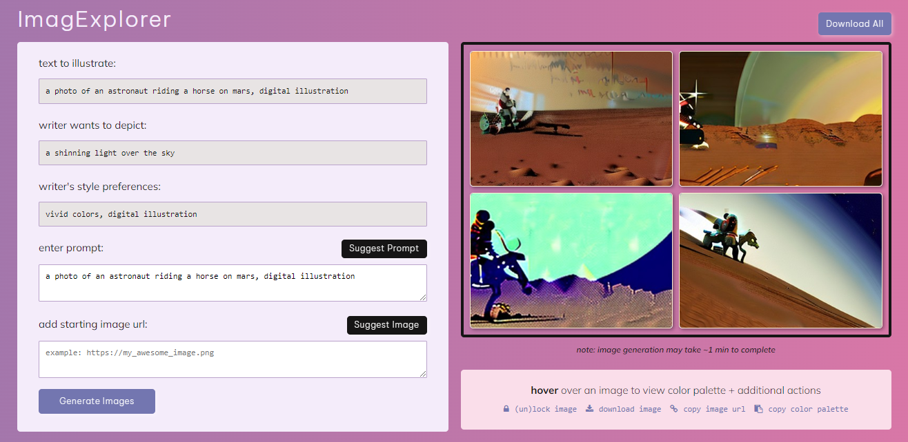

# ImagExplorer
An AI-powered brainstorming tool for writer-artist collaboration ([paper](https://tinyurl.com/imagexplorer-paper))

Made with:
* Stable Diffusion ([Replicate API](https://replicate.com/stability-ai/stable-diffusion/api))
* Flask

## overview


ImagExplorer is a reference image brainstorming tool for bridging writer-artist communication powered by Stable Diffusion, a text-to-image AI model. Artists can **a)** view the original text and writer requests for illustrations while **b)** generating reference images. ImagExplorer also **c)** provides suggestions for prompts and starting images to feed into Stable Diffusion. Generated images are **d)** displayed on the right, and once artists are satisfied with the results, they can perform additional actions **e)** such as downloading or sharing images with the writer.

## setup instructions
1. clone repo
```
git clone https://github.com/catherinesyeh/imagexplorer.git 
```

2. create virtual env
```
python3 -m venv env
```

3. activate env
```
source env/bin/activate
```

4. install requirements
```
pip3 install -r requirements.txt
```

5. set replicate API token env variable (grab token [here](https://replicate.com/account))
```
export REPLICATE_API_TOKEN=[your API key]
```

6. start app
```
python3 app.py
```
